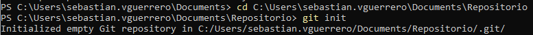

# LABORATORIO 1 CVDS

## PARTE I (Trabajo Individual).

### 1. Crea un repositorio localmente.

### 2. Agrega un archivo de ejemplo al repositorio, el README.md puede ser una gran opción.

### 3. Averigua para qué sirve y como se usan estos comandos git add y git commit -m “mensaje”

	- git add. Mueve los cambios del directorio de trabajo al área del entorno de ensayo.
	- El comando git commit captura una instantánea de los cambios preparados en ese momento del proyecto.

### 4. Abre una cuenta de github, si ya la tienes, enlazala con el correo institucional.

### 5. Crea un repositorio en blanco (vacío) e GitHub.

### 6. Configura el repositorio local con el repositorio remoto.

### 7. Sube los cambios, teniendo en cuenta lo que averiguaste en el punto 3 Utiliza los siguientes comando en el directorio donde tienes tu proyecto, en este orden:

### 8. Configura el correo en git local de manera correcta 

### 9. Vuelve a subir los cambios y observa que todo esté bien en el repositorio remoto (en GitHub)

## PARTE II (Trabajo en parejas)

### 1. Se escogen los roles para trabajar en equipo, una persona debe escoger ser "Owner" o Propietario del repositorio y la otra "Collaborator" o Colaborador en el repositorio.

	- Owner: Sebastián Villarraga
	- Colaborador: Andres Sepúlveda

### 2. El owner agrega al colaborador con permisos de escritura en el repositorio que creó en la parte 1
   

### 3. El owner le comparte la url via Teams al colaborador

   

### 4. El colaborador acepta la invitación al repositorio

### 5. Owner y Colaborador editan el archivo README.md al mismo tiempo e intentan subir los cambios al mismo tiempo.
   
   
   
   

### 6. ¿Qué sucedió?

    - cuando subimos los cambios desde GitHub al mismo tiempo ambos marcamos el commit con el nombre de cada uno a ver cual si se 
      guardaba, el de Sebastian Villarraga fue el que si se subio y el de Andres Sepulveda le arrojo los errores anteriores.
    - cuando subimos los cambios desde consola al mismo tiempo ambos marcamos el 'Git add .', el 'git commit' y el 'git push' al tiempo 
      con el nombre de cada uno a ver cual si se guardaba, el de Andres Sepulveda fue el que si se subio y el de Sebastian Villarraga le 
      arrojo el error anterior.
      
### 7. La persona que perdió la competencia de subir los cambios, tiene que resolver los conflictos, cúando haces pull de los cambios, los archivos tienen los símbolos <<< === y >>> (son normales en la resolución de conflictos), estos conflictos debes resolverlos manualmente.

Eliminamos los simbolos <, =, >, la palabra 'HEAD' y solo conservamos los cambios remotos, luego de esto hicimos el git add, git commit y git push

### 8. Volver a repetir un cambio sobre el README.md ambas personas al tiempo para volver a tener conflictos.

### 9. Resuelvan el conflicto con IntelliJ si es posible, Resolver conflictos en IntelliJ
    

## Parte III (Trabajo de a parejas)
### 1. ¿Hay una mejor forma de trabajar con git para no tener conflictos?

Sí, lo primero es verificar siempre que mi repositorio local esté actualizado con el remoto, también que cuando se quiera trabajar en una nueva
funcionalidad se usen ramas separadas de la principal de esta forma se facilita la corrección de posibles errores y reduce la posibilidad de conflictos.
Además, es buena práctica realizar commits pequeños y descriptivos y hacer push regularmente para evitar que los compañeros realicen cambios en el mismo codigo antes que uno. 

### 2. ¿Qué es y como funciona el Pull Request?

Un Pull Request es una herramienta que nos permite proponer cambios a un repositorio si subirlos de una vez, de esta forma se puede colaborar y
revisar el código antes de integrarlo a la rama principal. 

### 3. Creen una rama cada uno y suban sus cambios

los cambios de las ramas son los siguientes:
- Andres
Prueba pull request en rama master
- Sebastian
aaaaaaaa

4. Tanto owner como colaborador hacen un cambio en el README.md y hacen un Pull Request (PR) a la rama main/master

   
   

5. Teniendo en cuenta la recomendación, mezclen los cambios a la rama main a través de PR con el check/review/approval del otro compañero (Cuando se hace merge se deberían borrar las ramas en github)

   
   
   
   
   
   
   

