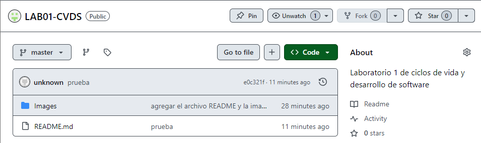

# LABORATORIO 1 CVDS

PARTE I (Trabajo Individual).

1. Crea un repositorio localmente.

2. Agrega un archivo de ejemplo al repositorio, el README.md puede ser una gran opción.

3. Averigua para qué sirve y como se usan estos comandos git add y git commit -m “mensaje”

	- git add. Mueve los cambios del directorio de trabajo al área del entorno de ensayo.
	- El comando git commit captura una instantánea de los cambios preparados en ese momento del proyecto.

4. Abre una cuenta de github, si ya la tienes, enlazala con el correo institucional.

5. Crea un repositorio en blanco (vacío) e GitHub.

6. Configura el repositorio local con el repositorio remoto.

7. Sube los cambios, teniendo en cuenta lo que averiguaste en el punto 3 Utiliza los siguientes comando en el directorio donde tienes tu proyecto, en este orden:

8. Configura el correo en git local de manera correcta 

9. Vuelve a subir los cambios y observa que todo esté bien en el repositorio remoto (en GitHub)

# PARTE II (Trabajo en parejas)

1. Se escogen los roles para trabajar en equipo, una persona debe escoger ser "Owner" o Propietario del repositorio y la otra "Collaborator" o Colaborador en el repositorio.

	- Owner: Sebastián Villarraga
	- Colaborador: Andres Sepúlveda

2. El owner agrega al colaborador con permisos de escritura en el repositorio que creó en la parte 1

